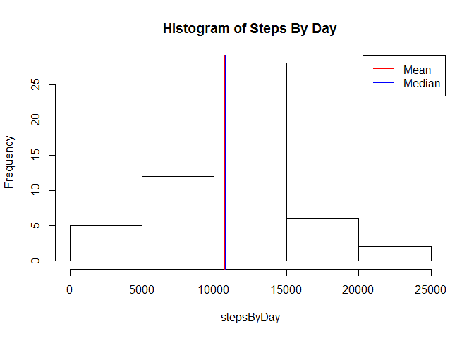
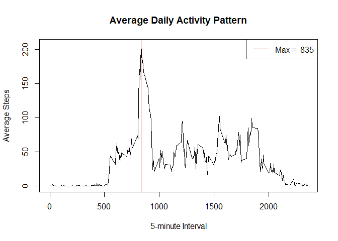
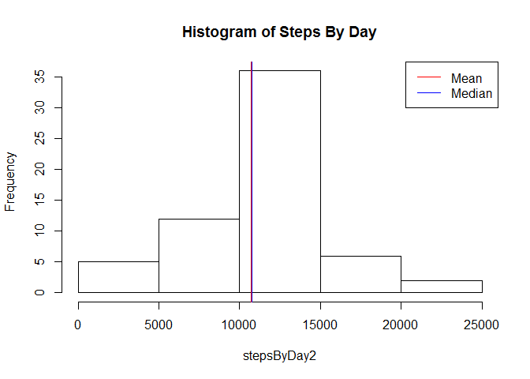

# Reproducible Research: Peer Assessment 1
Guillermo Pachón  
14 de mayo de 2016  


## Loading and preprocessing the data

Fist the data must be loaded. For convenience use the variable *activity* to store the data.  
Then use **dim** to show the dimensions of *activity*.


```r
activity <- read.table(unz("activity.zip", "activity.csv"), header=T, sep=",", na.strings = c("NA"))
dim(activity)
```

```
## [1] 17568     3
```

As you can see, 17568 rows with 3 columns (steps, date, interval) where loaded.

The data has the following structure:


```r
summary(activity)
```

```
##      steps                date          interval     
##  Min.   :  0.00   2012-10-01:  288   Min.   :   0.0  
##  1st Qu.:  0.00   2012-10-02:  288   1st Qu.: 588.8  
##  Median :  0.00   2012-10-03:  288   Median :1177.5  
##  Mean   : 37.38   2012-10-04:  288   Mean   :1177.5  
##  3rd Qu.: 12.00   2012-10-05:  288   3rd Qu.:1766.2  
##  Max.   :806.00   2012-10-06:  288   Max.   :2355.0  
##  NA's   :2304     (Other)   :15840
```

Aditionaly we need a correct format for *date* column:

```r
activity$date <- as.Date(as.character(activity$date), "%Y-%m-%d")
```

## What is mean total number of steps taken per day?

Lets ignore the missing values.


```r
activity1 <- na.omit(activity)
```

Calculate the total number of steps taken per day.  


```r
stepsByDay <- with(activity1, tapply(steps, as.factor(date), sum, na.rm = TRUE))
summary(stepsByDay, digits=5)
```

```
##    Min. 1st Qu.  Median    Mean 3rd Qu.    Max. 
##      41    8841   10765   10766   13294   21194
```

Then make a histogram.


```r
hist(stepsByDay, main = "Histogram of Steps By Day")
abline(v = mean(stepsByDay), lwd = 2, col = "red")
abline(v = median(stepsByDay), lwd = 1, col = "blue")
legend("topright", lwd = 1, col = c("red", "blue"), legend = c("Mean", "Median"))
```

<!-- -->

The mean (10766) and the median (10765) 
are shown in the same position.

## What is the average daily activity pattern?

Calculate the average steps by interval for all days and make a time series plot 
of the 5-minute interval and the average number of steps taken.  


```r
StepsByInterval <- aggregate(steps ~ interval, data = activity1, mean)
```

Next calculate the 5-minute interval that contains the max-average number of steps.


```r
MaxSBI <- StepsByInterval[StepsByInterval$steps == max(StepsByInterval$steps),]$interval
```

Finally make the plot.


```r
with(StepsByInterval, plot(interval, steps, type = "l", main = "Average Daily Activity Pattern", 
                              xlab = "5-minute Interval", ylab = "Average Steps"))
abline(v = MaxSBI, lwd = 1, col = "red")
legend("topright", lwd = 1, col = c("red"), legend = c(paste("Max = ", MaxSBI)))
```

<!-- -->

As the graphic show, the 5-minute interval, on average across all the days in the dataset, 
that contains the maximum number of steps is the **835**.

## Imputing missing values

1. Calculate and report the total number of missing values in the dataset (i.e. the total number of rows with NAs).

The following code show if the columns has any NA value:


```r
c(anyNA(activity$steps), anyNA(activity$date), anyNA(activity$interval))
```

```
## [1]  TRUE FALSE FALSE
```

So the number of missing values in the data set is determined by the missing values in **steps** column:


```r
nrow(activity[is.na(activity$steps),])
```

```
## [1] 2304
```

2. Devise a strategy for filling in all of the missing values in the dataset.
Use the mean for that 5-minute interval for filling the missing values:

For this job I use this function:


```r
MyFillNA <- function(act, meanSBI) {
    for(i in 1:nrow(act)) {
        if (is.na(act$steps[i])) {
            act$steps[i] = meanSBI[meanSBI$interval == act[i,]$interval, ]$steps
        }
    }
    act
}
```

3. Create a new dataset that is equal to the original dataset but with the missing data filled in:


```r
activity2 <- MyFillNA(activity, StepsByInterval)
summary(activity2)
```

```
##      steps             date               interval     
##  Min.   :  0.00   Min.   :2012-10-01   Min.   :   0.0  
##  1st Qu.:  0.00   1st Qu.:2012-10-16   1st Qu.: 588.8  
##  Median :  0.00   Median :2012-10-31   Median :1177.5  
##  Mean   : 37.38   Mean   :2012-10-31   Mean   :1177.5  
##  3rd Qu.: 27.00   3rd Qu.:2012-11-15   3rd Qu.:1766.2  
##  Max.   :806.00   Max.   :2012-11-30   Max.   :2355.0
```

4. Make a histogram of the total number of steps taken each day and Calculate and report the mean
and median total number of steps taken per day.


```r
stepsByDay2 <- with(activity2, tapply(steps, as.factor(date), sum))
```

Then make a histogram.


```r
hist(stepsByDay2, main = "Histogram of Steps By Day")
abline(v = mean(stepsByDay2), lwd = 2, col = "red")
abline(v = median(stepsByDay2), lwd = 1, col = "blue")
legend("topright", lwd = 1, col = c("red", "blue"), legend = c("Mean", "Median"))
```

<!-- -->

The mean (10766) and the median (10766) 
are shown in the same position.

**These values does NOT differ from the estimates from the first part of the assignment**. Remember the values: mean = 10766, and median = 10765. 

The impact of imputing missing data on the estimates of the total daily number of steps is NONE.

## Are there differences in activity patterns between weekdays and weekends?
